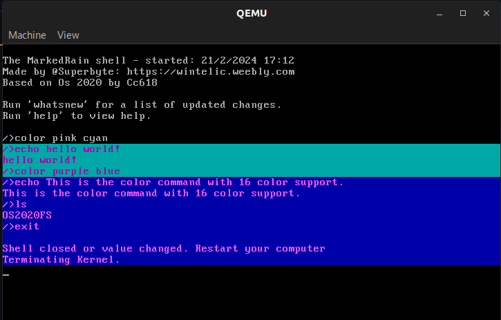
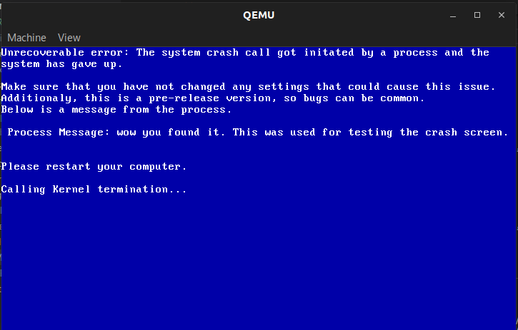

# Note

This project is not being updated. Please visit https://github.com/NTSP3/MarkedRain for the updated Operating System.

# "MarkedRain" Operating System beta

The "MarkedRain" is an OS based on OS 2020. It uses the OS2020 bootloader and filesystem.
This OS is nowhere near complete (and probably never will be) and should only be used within a Virual Machine.

## Showcase

## Architecture

- doc : Documentation
- src/stage1 : First bootloader chunk (full Asm)
- src/stage2 : Second bootloader chunk
- src/kernel : Core chunk
- src/lib : Libc and libk

## Depedencies

- gcc cross compiler (for i386)
- linker
- nasm
- virtualizer (qemu-system-i386)

## Compiling

In order to compile the MarkedRain OS, just use 'make' on the root directory. If you use a different compiler, edit the makefile accordingly.